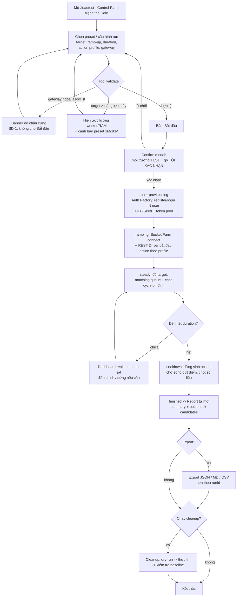

# UX-FLOW — MAYogu LoadTest Tool

**Phiên bản**: 0.1 — 2026-08-03
**Nguồn**: `docs/PRD-loadtest-tool.md` (v0.1) + khảo sát UI hiện tại `chat-app`
**Trạng thái**: Chờ review bởi UI Designer + LuxuryDeveloper
**Người thiết kế**: UX Architect (Agent)

---

## (a) Mục tiêu & phạm vi

### Mục tiêu
1. Định nghĩa toàn bộ **luồng tương tác** của MAYogu LoadTest Tool — từ mở dashboard, cấu hình, bấm **Bắt đầu**, quan sát live 1M user ảo, dừng/kill-switch, cho tới báo cáo và dọn dẹp — cùng các **nhánh lỗi/phục hồi** (worker chết, socket rớt, Redis/Kafka down, cleanup).
2. Cung cấp **wireframe ASCII** cho tất cả màn MVP trong PRD Mục (6), kèm chú thích component, trạng thái chính (loading / empty / error) và luồng điều hướng.
3. Căn chỉnh wireframe với **design system hiện tại của chat-app** để developer triển khai không phải quyết định kiến trúc UI.

### Phạm vi
- **Thiết kế UX/UI architecture — KHÔNG code.** Không sửa source, không tạo component.
- Bao gồm: user flow chính + nhánh lỗi (Mục b), wireframe 7 màn (Mục c), navigation map (Mục d), ghi chú chuyển giao UI Designer (Mục e).
- MVP = 10k–100k user trên 1 máy; preset 1M/10M chỉ hiển thị kèm cảnh báo hạ tầng (PRD §0, CP-1).
- Màn #3 (User Detail) trong PRD Mục (6) là **v1.1** — vẫn design để chốt khung, đánh dấu rõ.

### Nguyên tắc thiết kế xuyên suốt
- **Mobile-first baseline, thao tác 1 tay (thumb-zone)**: mọi màn vẽ theo khung mobile (~52 cột ASCII); nút chính (Bắt đầu / Dừng / Kill-switch) đặt **bottom sticky** trong vùng ngón cái (50–90% chiều cao màn hình), kích thước chạm ≥ 48px.
- **Desktop-enhanced layout** (ghi chú riêng cho màn dữ liệu dày đặc): khi viewport ≥ 1024px, Dashboard/Report/Control Panel chuyển sang **grid đa cột** (12 cột chuẩn Tailwind `grid-cols-12`), mobile vẫn là baseline 1 cột. Chi tiết ghi trong từng màn.
- **Dark-first**: app chat-app hiện chỉ có theme tối (token HSL trong `src/index.css`); mọi màu trong wireframe gọi bằng **tên token có sẵn** (`background`, `card`, `primary`, `destructive`, `muted-foreground`, `border`...) thay vì mã màu cứng.
- **Chỉ dùng component đã có** trong `src/components/ui/`: `Button` (variant `default/destructive/outline/secondary/ghost/gradient`), `Card`, `Dialog`, `Input`, `Label`, `Badge`, `ScrollArea`, `Skeleton`, `Separator`, `Textarea` + `sonner` (toast) + `lucide-react` (icon). Component **thiếu** (Select, Switch, Tabs, Tooltip, StatCard, Gauge...) liệt kê ở Mục (e) — chờ UI Designer thêm theo chuẩn shadcn/ui hiện có.
- **Tín hiệu lỗi nhất quán**: mọi trạng thái bất thường đều có (1) Badge/banner màu `destructive`, (2) hành động phục hồi rõ ràng, (3) log trace để kỹ sư theo dõi. Không dùng toast thoáng qua cho lỗi ảnh hưởng run — phải là banner dính.

### Thuật ngữ dùng chung trong wireframe
| Ký hiệu | Ý nghĩa |
|---|---|
| `[nút]` | Button — chữ trong ngoặc là nhãn |
| `[...box]` | Input / Textarea / Select |
| `(chip)` | Badge / chip chọn preset |
| `>` | Link điều hướng / drill-down |
| `!` | Cảnh báo (banner `destructive`/`amber`) |
| `#` | Skeleton / vùng đang tải |
| `...` | Dữ liệu động (không phải text cứng) |
| `[bottom]` | Vùng sticky bottom (thumb-zone) |

---

## (b) User flow chính + nhánh lỗi

### (b.1) Flow chính — "1 nút chạy tất cả"



**Text tree (tóm tắt)**:

```text
1. Mở dashboard: /loadtest  (trạng thái idle)
2. Chọn preset (10k/50k/100k/1M/10M/Custom) hoặc cấu hình tay
   |-- Nếu gateway URL ngoài allowlist -> banner đỏ chặn cứng (không hiện Bắt đầu)
   |-- Nếu preset 1M/10M -> cảnh báo hạ tầng + ước lượng worker/RAM
   |-- Bấm "Chỉnh sửa kịch bản" -> Scenario Builder (quay về sau khi lưu)
3. Bấm Bắt đầu -> Confirm modal (nhập "TÔI XÁC NHẬN", tick môi trường test)
4. Tool tự chạy (UI chuyển sang Live Dashboard):
   a. provisioning  : Auth Factory register/login -> token pool (progress realtime)
   b. ramping       : Socket Farm K worker connect; REST Driver chạy action
   c. steady        : chat cycle (enqueue -> matching:found -> chat:join -> send/echo)
   d. cooldown      : chờ echo dứt điểm, chốt số liệu
5. Quan sát live (<=3s độ trễ), có thể Tạm dừng / Tiếp tục / Dừng / Kill-switch
6. Kết thúc run -> Report: summary P50/P95/P99, bottleneck candidates, export
7. (Tùy chọn) Cleanup: dry-run -> thực thi -> kiểm tra baseline -> kết thúc
```

**Vòng đời 1 user ảo** (thể hiện dưới dạng mini-state trên Dashboard):

```text
provisioned -> connecting -> connected -> queued -> in_room
            -> idle/looping (read/comment/like theo pacing)
            -> [roomExpired | leave] -> cooldown 900s -> loop (nếu còn duration)
```

### (b.2) Các nhánh lỗi & phục hồi

| # | Sự cố | Phát hiện bởi | Phản ứng UI | Phục hồi |
|---|---|---|---|---|
| **E1** | Register fail > 50% (OTP seed lỗi, Redis down, throttler guest `1000/8s`) | Auth Factory metric | Run tự dừng → trạng thái `error` → Report lỗi tổng hợp (AC1.3); banner đỏ kèm mã lỗi phân loại | User sửa cấu hình (giảm register ramp / kiểm tra OTP_SECRET, Redis) → chạy lại; không bao giờ retry register cùng email sau khi OTP đã consume (PRD §5.2) |
| **E2** | Connect fail > 30% (gateway chết, token hết hạn, enforcement disconnect) | Socket Farm metric | Run tự dừng, cảnh báo trên Dashboard + Report | Kiểm tra gateway test, log token error; chạy lại với target thấp hơn |
| **E3** | **Worker chết** giữa chừng (crash, OOM) | Coordinator heartbeat (mất ping > ngưỡng) | Dashboard hiện banner "N worker mất kết nối" + KPI user active tụt; run chuyển `degraded` nếu < 30% worker chết | Coordinator tự **restart worker** với cấu hình cũ (backoff); nếu > 50% worker chết trong 60s → auto-stop + report lỗi |
| **E4** | **Socket mất kết nối** (reconnect) | per-socket `disconnect`/`connect_error` | Đếm `reconnects`; không báo lỗi từng user; hiển thị nhẹ trên chart `connections` bị nhấp nhô | Reconnect backoff 1s→10s (kế thừa `socket.ts:77-91`), **re-join room sau connect** (PRD §1.2); user chuyển `connecting` → `connected` |
| **E5** | **Redis down** (matching, enforcement, OTP seed) | request thất bại hàng loạt | Banner đỏ "Redis test không phản hồi"; queue-count đóng băng; enforcement server-side fail-open (gateway tự xử lý) | Nếu OTP seed không ghi được → register fail → E1 (auto-stop). Nếu Redis chết giữa run: matching dừng → queue-count tụt về 0 → cảnh báo bottleneck, run tiếp tục để đo hành vi |
| **E6** | **Kafka down / chậm** | echo `chat:message` không tới trong TTL 60s | Chat echo rate < 95% → **cảnh báo bottleneck** (không auto-stop — đây chính là mục tiêu đo); phân tách "rate-limited (no echo)" khỏi "lỗi thật" (PRD §5.3) | Tool tự giảm pacing send nếu outbox đầy (ring buffer giới hạn 1000 pending/user) — không để memory tăng vô hạn; cooldown cuối run chờ echo dứt điểm |
| **E7** | **Kill-switch** (bấm Dừng khẩn) | UI/CLI | Modal xác nhận 1 lần (danger, 5s đếm ngược) → dừng mọi worker ≤ 5s, disconnect sạch ≤ 10s → `finished` (partial) + Report partial | Report ghi rõ "run bị dừng thủ công, số liệu partial"; cleanup vẫn chạy được |
| **E8** | **Cleanup fail** (xóa user/post/Redis key lỗi) | Cleanup runner | Báo lỗi **từng bước** (bước nào ok/ko), banner đỏ; baseline check sau xóa fail → cảnh báo "còn dữ liệu test" | Cho phép chạy lại cleanup từ bước lỗi (idempotent); log trace để kỹ sư xóa tay |
| **E9** | **Dashboard WebSocket rớt** (dashboard ↔ coordinator) | socket dashboard | Banner "Đang kết nối lại dữ liệu live..." + chart tạm đóng băng | Reconnect + sync snapshot mới nhất từ coordinator (aggregation 1s nên backlog ≤ 3s); sau khi nối lại, chart tiếp tục từ timestamp hiện tại |
| **E10** | Access token hết hạn giữa run (duration > 60 phút) | 401 khi gọi REST / socket disconnect vì token hết hạn | MVP: chặn từ đầu (duration ≤ 60 phút, control disabled kèm tooltip) | v1.1: refresh token hàng loạt (AF-5) |
| **E11** | Chạm ngưỡng phát hiện bottleneck (queue tăng > 5 phút, P95 tăng > 2×, worker CPU > 85%) | Bottleneck detector | Dashboard hiện **banner nghi vấn** kèm nút "Xem bằng chứng" → nhảy tới chart vùng nghi vấn | Không tự dừng (trừ E1/E2); ghi vào Report như bottleneck candidate |

**Quy tắc dừng tự động (auto-stop) tổng hợp:**

```text
auto-stop khi:
  - register fail > 50%            (E1)
  - connect fail > 30%             (E2)
  - > 50% worker chết trong 60s    (E3)
  - kill-switch thủ công           (E7)

KHÔNG auto-stop (chỉ cảnh báo, vì là mục tiêu đo):
  - echo rate thấp / Kafka chậm    (E6)
  - queue-count tăng               (E11)
  - latency tăng                   (E11)
```

---

## (c) Wireframe ASCII — từng màn MVP

> Ký hiệu `[bottom]` = vùng sticky dưới cùng (thumb-zone). Mỗi màn kèm: chú thích component, trạng thái chính, điều hướng, và ghi chú desktop-enhanced.

---

### MÀN 1 — Control Panel (`/loadtest`) — MVP

**Trạng thái run hiển thị**: `idle | provisioning | ramping | steady | cooldown | finished | error` (CP-3) — badge trên header + timeline phase.

```text
+--------------------------------------------------+
| MAYogu LoadTest                       (chip:IDLE)|   <- header: Badge trạng thái run
+--------------------------------------------------+
| [Tab bottom: Cau hinh] [Live] [Bao cao] [Cai dat]|   <- desktop: nav header trên
+--------------------------------------------------+
| PRESET                                            |
| (10k) (50k) (100k) (1M!) (10M!) (Custom)          |   <- preset 1M/10M có icon cảnh báo
+--------------------------------------------------+
| CAU HINH RUN                                      |
| Target users         [  10,000        ]           |
| Ramp-up              [ 500/s v][ trong 5 phut ]   |
| Duration             [ 30 phut v ]                |
| Action profile       [ chat40/read30/.. ]     >   |   <- mở Scenario Builder (Màn 4)
| Gateway (test)       [ ws://test-01...   ]     >  |   <- readonly, sửa ở Settings
| > Chinh sua kich ban (YAML)                       |
+--------------------------------------------------+
| ! Preset 1M can ~32-40 workers + >=64GB RAM.      |
|   May hien tai (~16 core/64GB) chi du cho <=100k. |   <- banner cảnh báo hạ tầng
+--------------------------------------------------+
| UOC LUONG                                         |
| 4 workers | ~2GB RAM | seat 100k ~ 17 phut       |   <- estimate từ target (matching 100/s)
| (tinh tu cau hinh, cap nhat realtime)             |
+--------------------------------------------------+
| TONG QUAN NHANH (khi run dang chay)               |
| user tao 12.3k | connect 11.9k | active 8.4k     |   <- 3 stat nhỏ, cập nhật 1s
+--------------------------------------------------+
|   [  BAT DAU  ]                                   |   <- [bottom] thumb-zone, disabled nếu
+--------------------------------------------------+      gateway ngoài allowlist / target > capacity
```

**Chú thích component:**

| Vùng | Component (có sẵn / cần thêm) |
|---|---|
| Header | `Card` nền trong suốt + `Badge` trạng thái run (idle=secondary, provisioning=amber pulse, ramping=primary, steady=emerald, cooldown=amber, finished=secondary, error=destructive) |
| Preset | Chips (cần thêm component `Select`/chip-group; dùng `Button variant=outline` + `variant=default` khi active) |
| Form | `Card` chứa `Label` + `Input`/`Select` (Select chưa có — thêm theo shadcn/ui); số dùng native `input[type=number]` |
| Cảnh báo | Banner `destructive` nếu allowlist fail (chặn cứng, ẩn nút Bắt đầu), `amber` nếu chỉ cảnh báo hạ tầng |
| Estimate | `Card` + text muted; tính phía client từ cấu hình (workers, RAM, thời gian seat) |
| CTA | `Button size=lg variant=default` (Bắt đầu), khi run: `destructive` (Dừng) — sticky bottom |

**Trạng thái chính:**
- **Loading**: form hiện `Skeleton` cho preset + estimate (đang đọc config/allowlist từ Settings); nút Bắt đầu disabled.
- **Empty**: chưa có run nào — tổng quan nhanh ẩn; hiện hint "Cấu hình xong bấm Bắt đầu".
- **Error**: gateway ngoài allowlist → banner đỏ + nút Bắt đầu bị ẩn; target > capacity → cảnh báo nhưng vẫn cho phép Bắt đầu (user tự chịu trách nhiệm, run sẽ chậm).
- **Running**: form bị khóa (disabled), CTA chuyển thành cụm `[Tạm dừng] [Dừng]` + đồng hồ elapsed; badge phase chạy timeline: `provisioning -> ramping -> steady -> cooldown`.

**Confirm modal trước Bắt đầu** (SD-1) — `Dialog`:

```text
+--------------------------------------------+
| CANH BAO MOI TRUONG TEST                    |
| Ban sap chay LOAD TEST tren:                |
|   ws://test-01.mayogu.test                  |
| Tool se tao user that va gui traffic that.  |
| KHONG bao gio chay tren production.         |
|                                            |
| Go: [ TÔI XÁC NHẬN____________ ]            |
|                                            |
|        [ Huy ]      [ Bat dau ]  <- disabled |
|                                  cho den khi |  
|                                  gõ đúng     |
+--------------------------------------------+
```

**Kill-switch confirm** (SD-3): `Dialog` tương tự, biến thể destructive: "Dừng toàn bộ worker ≤ 5s? Số liệu sẽ là partial." Nút `Dừng ngay` đếm ngược 5s (tránh bấm nhầm).

**Điều hướng:** Bắt đầu → tự chuyển sang Màn 2 (Live Dashboard). "Chỉnh sửa kịch bản" → Màn 4. Header ⚙ → Màn 6. Khi run kết thúc → Màn 5.

**Desktop-enhanced (≥1024px):** grid 12 cột — cột trái (4 cột): preset + form + confirm; cột phải (8 cột): estimate + tổng quan nhanh + timeline phase dạng thanh ngang. CTA vẫn sticky bottom full width (hoặc đặt phải, dưới cột trái) — giữ vị trí cố định, không nhảy.

---

### MÀN 2 — Live Dashboard (MVP)

> **Ghi chú dữ liệu dày đặc**: đây là màn "1 triệu user đang làm gì" — mobile baseline xếp dọc theo thứ tự ưu tiên quan sát (KPIs → chart connections → latency → lỗi), desktop dùng grid đa cột (mô tả cuối màn). Mọi chart tự cập nhật ≤ 3s (AC5.1), không cần refresh trang.

```text
+--------------------------------------------------+
| LIVE: run abc123    [steady]   01:23:45  (LIVE)   |   <- runId + badge phase + elapsed
| [Tam dung] [Dung]                         [log] > |   <- controls luôn truy cập được
+--------------------------------------------------+
| KPI (2x2 lưới)                                    |
| connect 11,982 | active 8,401  | actions/s 4,120  |
| success 98.2%  | echo 96.1%    | queue 1,204      |
| rooms 2,003    | ws_server 12,040                |   <- 7-8 stat tiles, desktop: 1 hàng
+--------------------------------------------------+
| ACTIVE CONNECTIONS                     [30m v]  > |   <- line chart, time-range select
| |#\   /#\        /#\                             |
| |#\  #  #\  /\  /  #\      (downsampled 1s)      |
| +-----------------------------------------+      |
+--------------------------------------------------+
| ACTIONS/S THEO LOAI (stacked area)                |
| chat 40% | read 30% | comment 20% | like 10%     |   <- legend màu categorical
+--------------------------------------------------+
| LATENCY P50/P95/P99 (line, log-scale toggle)      |
| [log] P50 120ms | P95 480ms | P99 1.2s            |   <- toggle log/linear
+--------------------------------------------------+
| SUCCESS RATE            | CHAT ECHO RATE          |
| [==== 98.2% ] gauge     | [==== 96.1%] gauge      |
+--------------------------------------------------+
| ! Bottleneck nghi van: queue tang lien tuc >5p    |
|   [Xem bang chung >]                             |   <- banner E11, nhảy tới chart
+--------------------------------------------------+
| TOP ERRORS                    (mã lỗi | freq)     |
| 429 CHAT_TOPIC_RATE_LIMITED    3,102              |
| 429 CHAT_COOLDOWN_ACTIVE      2,847               |
| 5xx gateway timeout              198              |
| > Xem tat ca                                       
+--------------------------------------------------+
| SERVER-SIDE (gateway /metrics)                    |
| ws_connections 12,040 | msgs_emitted 8.1M         |
+--------------------------------------------------+
| [Tab bottom: Cau hinh] [Live] [Bao cao] [Cai dat] |
+--------------------------------------------------+
```

**Chú thích component:**

| Vùng | Component |
|---|---|
| Header | Giống Màn 1 + đồng hồ elapsed; badge `LIVE` (emerald, nhấp nháy khi run chạy; `FROZEN` xám khi đã dừng) |
| KPI | **Cần thêm `StatCard`** (title, value lớn, delta, sparkline nhỏ tùy chọn) — chuẩn shadcn/ui mới |
| Charts | **Cần thêm recharts** (PRD DB-2). Line chart connections; stacked area actions/s; line P50/P95/P99; gauge success/echo (có thể dùng `RadialBarChart` của recharts) |
| Bảng lỗi | `Table` (chưa có — thêm) hoặc `ScrollArea` chứa hàng tùy chỉnh; cột: mã lỗi, tần suất, mẫu payload |
| Server metrics | `Card` + text; nguồn scrape `/metrics` (DB-3) |
| Cảnh báo bottleneck | Banner amber + nút drill-down |
| Controls | `Button` nhỏ `outline` (Tạm dừng), `destructive` (Dừng) — luôn hiện khi run chạy |

**Trạng thái chính:**
- **Loading**: toàn bộ chart hiện `Skeleton` (bộ khung chart) + text "Đang kết nối dữ liệu live...".
- **Empty**: run mới bắt đầu, chưa có điểm dữ liệu — chart trống với empty-state "Chờ dữ liệu 1s đầu tiên..."; KPI hiện `--`.
- **Error**: (1) WS dashboard rớt (E9) → banner "Đang kết nối lại..." + chart đóng băng, tự phục hồi; (2) coordinator báo lỗi run (E1/E2) → banner destructive + chuyển Màn 5.
- **Frozen (sau run)**: run dừng → badge `FROZEN`, chart **giữ nguyên** để phân tích (AC5.3), banner "Run đã kết thúc — số liệu cuối. [Xem báo cáo >]".

**Điều hướng:** Header "Xem báo cáo" → Màn 5 (khi finished). Tap 1 user trong bảng/điểm chart (v1.1) → Màn 3. Tab bottom ↔ các màn khác.

**Desktop-enhanced (≥1024px):** grid 12 cột, 2 tầng:
- Hàng 1 (full width): KPI 8 tiles (6-8 cột mỗi tile `col-span-...`).
- Hàng 2: `col-span-8` chart lớn (connections + latency đè trục hoặc 2 chart xếp), `col-span-4` cột phải: 2 gauge + queue + rooms.
- Hàng 3: `col-span-7` actions/s stacked, `col-span-5` bảng top errors + server metrics.
- Tooltip chart chỉ hiện 1 điểm dữ liệu; thêm toggle range (5m/15m/30m/tất cả). Không dùng animation framework nặng cho chart (tránh re-render 100k events/s — dùng `React.memo` + store cập nhật 1s).

---

### MÀN 3 — User Detail / Inspect (v1.1 — thiết kế khung, chưa triển khai MVP)

```text
+--------------------------------------------------+
| [<] User #4821 (loadtest.abc123.4821@mayogu.test)|
+--------------------------------------------------+
| TRANG THAI                                        |
| phase        in_room                             |   <- state machine hiện tại
| worker       w-07                                |
| roomId       r-5f2a (6/6 members)                |
| token        ok (exp 38 phut)                     |
| reconnect    2 lan | outbox pending 0             |
+--------------------------------------------------+
| [Theo doi]  <- toggle: pin user, xem realtime     |   <- DB-5 "follow"
+--------------------------------------------------+
| TIMELINE (200 event gan nhat)                     |
| 01:23:40.102  SEND  chat:send #8821 -> echo OK    |
| 01:23:42.105  RECV  chat:message (echo 8821)      |
| 01:23:45.000  RECV  chat:typing (user 3312)       |
| 01:23:47.011  SEND  POST /like/post/994 (200, 45ms)|
| 01:24:00.000  RECV  roomExpired (re-enqueue sau)   |
| > Xem them (virtualized)                           |
+--------------------------------------------------+
| HANH DONG: [Disconnect] [Force leave] [Xem log]   |   <- v1.1: điều khiển 1 user
+--------------------------------------------------+
```

**Chú thích:** danh sách timeline trong `ScrollArea` (bounded 200, virtualized khi cần — 100k events/s không thể render hết); trạng thái phase dùng Badge cùng palette Màn 1. **Trạng thái:** loading = skeleton; empty = "Không tìm thấy user" (nhập sai index); error = user đã bị xóa/run đã dừng → empty-state kèm nút quay lại.

**Điều hướng:** vào từ Màn 2 (tap user) — v1.1. Desktop: panel bên phải (`Dialog`/drawer), không rời màn Dashboard.

---

### MÀN 4 — Scenario Builder (MVP — cần cho SE-1 profiles)

```text
+--------------------------------------------------+
| KICH BAN: default-scenario.yaml       [Luu] [Load]|
+--------------------------------------------------+
| PROFILES (phân bố action, tổng phải = 100%)       |
| chat   [40]% | read [30]% | comment [20]% | like  |
| [10]%   -> hiện cảnh báo nếu tổng != 100          |
+--------------------------------------------------+
| PACING                                              |
| chat send >= 2s/user | typing 1.5s | topic 15s     |   <- readonly, đọc từ hệ thống
| (khóa cứng theo rate-limit thật — không sửa được)   |
+--------------------------------------------------+
| EDITOR YAML (monospace textarea, dòng có số)       |
| # phases:                                          |
| rampUp: 300s                                       |
| duration: 1800s                                    |
| profiles:                                          |
|   chat: 0.4 ...                                    |
+--------------------------------------------------+
| VALIDATE                                           |
| [Kiem tra]  -> 3 loi, 1 canh bao:                  |
|  ! duration 1800s > 3600s? (ok)                    |
|  x phase rampUp 300s -> 100k/s vuot matching trần  |
|  x topic cap 6/phong vi pham                      |
+--------------------------------------------------+
| [bottom] [ Huy ]              [ Luu & ap dung ]    |
+--------------------------------------------------+
```

**Chú thích component:** editor = `Textarea` (monospace, class `font-mono`) tạm thời; validate theo hệ giới hạn thật (chat 2s, cooldown 900s, matching 100/s, topic 15s/cap 6 — PRD §1.4) — danh sách cảnh báo dạng list với Badge lỗi/cảnh báo. **Trạng thái:** loading = skeleton editor + "Đang tải kịch bản mặc định"; empty = editor rỗng + nút "Tạo từ template"; error = YAML sai cú pháp → highlight dòng lỗi + toast `sonner`.

**Điều hướng:** vào từ Màn 1 ("Chỉnh sửa kịch bản"); "Lưu & áp dụng" → quay về Màn 1 với profile đã đổi. Desktop (≥1024px): editor trái (`col-span-8`) + profiles/pacing/validation phải (`col-span-4`).

---

### MÀN 5 — Report (MVP)

```text
+--------------------------------------------------+
| BAO CAO: run abc123              [finished]       |   <- badge: finished/stopped/error
| 2026-08-03 01:00-01:30 (30 phut) | thuc te 28:41   |
+--------------------------------------------------+
| SUMMARY (4 stat)                                  |
| user tao 12,000 | connect max 11,850 | active 9,102|
| actions 8.2M | success 98.2% | thruput peak 4.4k/s|
+--------------------------------------------------+
| LATENCY P50/P95/P99 THEO ACTION (bảng)            |
| action     p50    p95    p99    success  count    |
| chat:send  118ms  482ms  1.21s  96.1%    1.1M     |
| read:feed  45ms   190ms  402ms  99.4%    2.4M     |
| comment    210ms  890ms  1.9s   97.8%    1.6M     |
| like       38ms   141ms  310ms  99.9%    820k     |
+--------------------------------------------------+
| BOTTLENECK CANDIDATES (RE-2)                      |
| 1. [High] queue-count tang lien tuc 12 phut       |
|    bang chung: [Bieu do vung ngh van >]           |
|    -> matching trần ~100 user/s (MAX_POP=200/2s)  |
| 2. [Med]  chat echo rate 96.1% (< 97% du kien)    |
|    -> nghien ngo rate-limit / Kafka tre           |
+--------------------------------------------------+
| CAU HINH RUN (snapshot day du)                    |
| target 10k | ramp 500/s | duration 30m | profile  |
| chat40/read30/comment20/like10 | gateway test-01  |
+--------------------------------------------------+
| EXPORT: [JSON] [Markdown] [CSV]  [Luu tru 30 ngay]|
+--------------------------------------------------+
| [bottom] [ Dong cleanup du lieu test > ]           |
+--------------------------------------------------+
```

**Chú thích component:** bảng latency = `Table` (cần thêm) hoặc hàng `Card`; bottleneck candidates = danh sách Card kèm Badge mức độ `High/Med/Low` + nút "Xem bằng chứng" (mở chart thu nhỏ vùng nghi vấn — `Dialog` chứa chart recharts). Export dùng `Button variant=outline` + toast `sonner` khi thành công. **Trạng thái:** loading = skeleton bảng + "Đang tổng hợp ≤ 30s" (AC6.1); empty = chưa có run → hướng dẫn chạy run đầu tiên; error = run bị kill giữa chừng → banner "Số liệu partial — run bị dừng thủ công".

**Điều hướng:** mở tự động sau run kết thúc; từ Dashboard (FROZEN); "Dọn dẹp dữ liệu test" → Màn 7. Desktop: summary 4 cột 1 hàng; bảng latency + bottleneck 2 cột (7/5).

---

### MÀN 6 — Settings (MVP)

```text
+--------------------------------------------------+
| CAI DAT                                             |
+--------------------------------------------------+
| MOI TRUONG TEST (allowlist - chặn cứng SD-1)      |
| ws://test-01.mayogu.test          [x]             |
| ws://test-02.mayogu.test          [x]             |
| [Them URL test] [ url ] [Them]                    |
| ! URL ngoai danh sach se bi chan o Man 1          |
+--------------------------------------------------+
| SECRETS / TEST ENV                                 |
| OTP_SECRET path     [ C:/secrets/otp.test.env ]   |
| Redis (write)      [ redis://test-redis:6379/3 ]  |
| (chi hien thi dang ky tu, khong in gia tri)        |
+--------------------------------------------------+
| GIOI HAN MAC DINH                                   |
| register ramp     [100] req/s (guest bucket 1000/8)|
| per-user pacing   [100] action/s max              |
| max duration      [60] phut (access token 1h)     |
| report retention  [30] ngay                       |
+--------------------------------------------------+
| AN TOAN                                             |
| [x] Bat buoc xac nhan moi truong truoc khi chay   |
| [ ] Auto-cleanup sau run (v1.1)                   |
| [Mo cong cu Cleanup >]                            |   <- vào Màn 7
+--------------------------------------------------+
| [bottom] [ Huy ]              [ Luu cau hinh ]     |
+--------------------------------------------------+
```

**Chú thích:** input secret dùng `Input type=password` với nút hiện/ẩn; allowlist là danh sách chip + Input + Button "Thêm". Tất cả giá trị lưu localStorage (CP-4) + export/import JSON (v1.1). **Trạng thái:** loading = skeleton form (đọc config); empty = allowlist rỗng → cảnh báo "Chưa có môi trường test nào — tool sẽ chặn mọi run"; error = secret file không đọc được → banner đỏ + hint cách sửa.

**Điều hướng:** vào từ ⚙ header (mọi màn); "Mở công cụ Cleanup" → Màn 7. Desktop: form 2 cột (7/5) — trái: môi trường + secrets; phải: giới hạn + an toàn.

---

### MÀN 7 — Cleanup (MVP — có thể gộp Settings, giữ màn riêng cho rõ luồng)

```text
+--------------------------------------------------+
| CLEANUP: run abc123          [Dry-run] [Thuc thi]  |
+--------------------------------------------------+
| TIM THAY (namespace loadtest.abc123.*)            |
| user         12,000  (email loadtest.abc123.*)    |
| post/comment  8,140  (prefix [lt])                |
| redis keys   23,512  (otp:register / match / chat)|
| session/device 12,000 (deviceInfo cua user test)  |
+--------------------------------------------------+
| BUOC THUC HIEN (3 tầng, chạy tuần tự)              |
| [x] 1. API nghiep vu: delete user/post/comment    |
| [x] 2. Redis: del key theo pattern namespace      |
| [o] 3. Kiem tra baseline:                         |
|        ZCARD match:queue:waiting = 0 (ok)         |
|        user loadtest.* con lai = 0 (ok)           |
|        post/comment [lt] con lai = 0 (ok)         |
+--------------------------------------------------+
| ! Canh bao: 23,512 redis keys bi xoa. Tiep tuc?   |   <- confirm 1 lần trước Thực thi
+--------------------------------------------------+
| [bottom] [ Quay lai ]        [ Thuc thi xoa ]      |
+--------------------------------------------------+
```

**Chú thích:** bảng tìm thấy = hàng `Card` với số lượng; mỗi bước có trạng thái `pending/ok/fail` (Badge) — fail thì dừng chuỗi, cho chạy lại từ bước lỗi (E8, idempotent). Dry-run = đọc và hiển thị, KHÔNG xóa (SD-4). **Trạng thái:** loading = skeleton bảng + "Đang quét dữ liệu test..."; empty = "Không tìm thấy dữ liệu test — hệ thống sạch" (Badge emerald); error = baseline check fail → banner đỏ liệt kê thứ còn sót.

**Điều hướng:** vào từ Report ("Dọn dẹp dữ liệu test") hoặc Settings; sau khi xong sạch → toast success + nút "Về Control Panel". Desktop: bảng trái (`col-span-7`) + các bước phải (`col-span-5`).

---

## (d) Navigation map

```text
                    ┌─────────────────────────────┐
                    │   Màn 6: Settings (⚙ header) │
                    │   /loadtest/settings         │
                    └──────────┬──────────────────┘
                               │ "Mở Cleanup"
                               v
  ┌────────────┐  "Chỉnh sửa kịch bản"  ┌──────────────┐
  │ Màn 1:     │ ─────────────────────> │ Màn 4:       │
  │ Control    │ <──── "Lưu & áp dụng" ─ │ Scenario     │
  │ Panel      │                        │ Builder      │
  │ /loadtest  │                        │ /loadtest/   │
  └─────┬──────┘                        │ scenario     │
        │ Bắt đầu (confirm modal)       └──────────────┘
        v
  ┌─────────────┐  tap user (v1.1)   ┌──────────────┐
  │ Màn 2: Live │ ─────────────────> │ Màn 3: User  │
  │ Dashboard   │ <──── back ─────── │ Detail (v1.1)│
  │ /loadtest/  │                    │ /loadtest/   │
  │ live        │                    │ users/:id    │
  └──────┬──────┘                    └──────────────┘
         │ run kết thúc (tự mở)
         v
  ┌─────────────┐  "Dọn dẹp dữ liệu test"  ┌─────────────┐
  │ Màn 5:      │ ───────────────────────> │ Màn 7:      │
  │ Report      │                          │ Cleanup     │
  │ /loadtest/  │                          │ /loadtest/  │
  │ report      │                          │ cleanup     │
  └─────────────┘                          └──────┬──────┘
                                                  │ xong -> "Về Control Panel"
                                                  v
                                            Màn 1 (idle, sẵn sàng run mới)
```

**Quy tắc điều hướng:**
1. **Luồng "1 nút" không rời dashboard**: Bắt đầu không điều hướng trang — Màn 1 chuyển view sang Màn 2 trong cùng route `/loadtest` (view switch theo run state). Report/Scenario/Settings/Cleanup là route riêng.
2. **Controls Dừng/Kill-switch phải truy cập được từ mọi nơi khi run chạy** (sticky header chung) — không bắt user quay lại Màn 1 để dừng.
3. Màn 3 chỉ tới được khi run chạy/dừng gần đây (v1.1) — dữ liệu user không còn sau cleanup.
4. Tab bottom (mobile): Cấu hình / Live / Báo cáo / Cài đặt — báo cáo chỉ hiện khi có run kết thúc (ngược lại disabled + tooltip).

---

## (e) Ghi chú chuyển giao UI Designer

**Design system hiện tại (đã khảo sát):** React 18 + Vite + Tailwind (dark-mode class) + Radix UI + CVA (chuẩn shadcn/ui); token HSL trong `src/index.css` (`--primary: 263 78% 62%` tím, `--accent: 291 64% 64%` hồng, background rất tối `255 23% 5%`); component có sẵn: `button/card/dialog/input/label/scroll-area/separator/skeleton/badge/textarea/sonner`; icon `lucide-react`; animation `framer-motion` + `tailwindcss-animate`; state `zustand`; routing `react-router-dom` v6 (routes trong `src/lib/env.ts`).

**Danh sách component cần UI Designer thêm (theo đúng chuẩn shadcn/ui hiện có):**
1. **Chart library — quyết định sớm nhất**: chưa có thư viện chart trong `package.json`; PRD DB-2 chốt recharts. Cần define **palette categorical 8 màu** cho stacked actions (chat/read/comment/like/...) + 3 series P50/P95/P99, **colorblind-safe, hoạt động trên nền tối** (không dùng màu đỏ/xanh đơn thuần cho P50/P95/P99 — kèm dấu/hình gạch nét để phân biệt).
2. **Component còn thiếu**: `Select` (dropdown), `Switch` (bật/tắt auto-cleanup), `Tabs` (điều hướng), `Tooltip` (chart hover), `Table` (bảng lỗi/latency), `StatCard` (KPI tile — dùng nhiều nhất ở Màn 2/5), `Gauge` (success/echo rate), `Progress` (phase timeline), chip-group preset. Tất cả làm theo pattern CVA + Radix như các file hiện có.
3. **Dark-only đang là hiện trạng** — dashboard/report nên theo dark-first luôn; nhưng 2 màn dữ liệu dày đặc (Live Dashboard, Report) cần **hệ thống phân cấp dữ liệu**: value chính to + đậm, label muted nhỏ, border mờ — tránh 60 tile sáng rực trên nền tối. Chart axes/gridline dùng `--border`, text dùng `--muted-foreground`.
4. **Hiệu năng rendering (bắt buộc, không phải tùy chọn)**: dashboard nhận 100k events/s aggregate; cấm animation `framer-motion` trên chart; dùng `React.memo` + store cập nhật 1 tick/s (zustand selector), recharts `<ResponsiveContainer>` với downsampling phía coordinator; tooltip hiện 1 điểm duy nhất. Đây là AC5.4 — UI phải chịu được mật độ này.
5. **Trạng thái LIVE vs FROZEN phải phân biệt rõ**: sau run, chart đóng băng nhưng trông vẫn "sống" sẽ gây hiểu nhầm — badge + border màu thay đổi + banner "Số liệu cuối" kèm CTA sang Report.
6. **A11y trên nền tối**: lỗi dùng `--destructive` (đỏ) cần tương phản ≥ 4.5:1 trên `--background` tối; banner cảnh báo phải là vùng có `role="alert"`; confirm modal focus trap (Radix Dialog đã hỗ trợ); kích thước chạm ≥ 48px cho Dừng/Kill-switch; không phụ thuộc màu duy nhất để truyền đạt trạng thái.

**Ghi chú khác:**
- Preset 1M/10M phải hiển thị "cảnh báo hạ tầng" dạng banner **không thể đóng vĩnh viễn** (có thể đóng cho phiên, lần sau hiện lại) — tránh chạy 1M trên máy không đủ tài nguyên.
- Confirm "TÔI XÁC NHẬN" (SD-1) là **chặn cứng** — nút Bắt đầu disabled đến khi gõ đúng chuỗi; không đơn thuần là checkbox.
- Export dialog nằm trong Màn 5: chọn format + tên file mặc định `report-{runId}.{ext}`; sau export toast success kèm đường dẫn tuyệt đối.

---

**Kết luận chuyển giao:** wireframe trên là baseline mobile-first + ghi chú desktop-enhanced cho 3 màn dữ liệu dày đặc. Thứ tự triển khai UI đề xuất: (1) Màn 1 Control Panel + confirm modal, (2) Màn 2 Live Dashboard (cần UI Designer chốt chart palette trước), (3) Màn 5 Report, (4) Màn 6/7 Settings+Cleanup, (5) Màn 4 Scenario Builder, (6) Màn 3 (v1.1). Sẵn sàng bàn giao LuxuryDeveloper triển khai.
